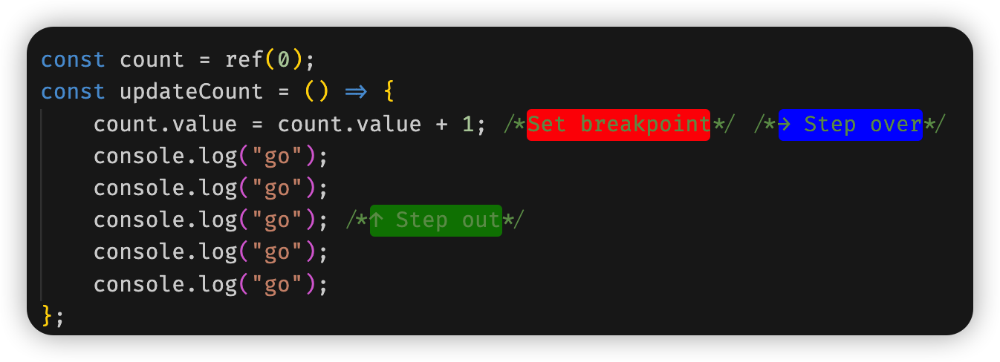
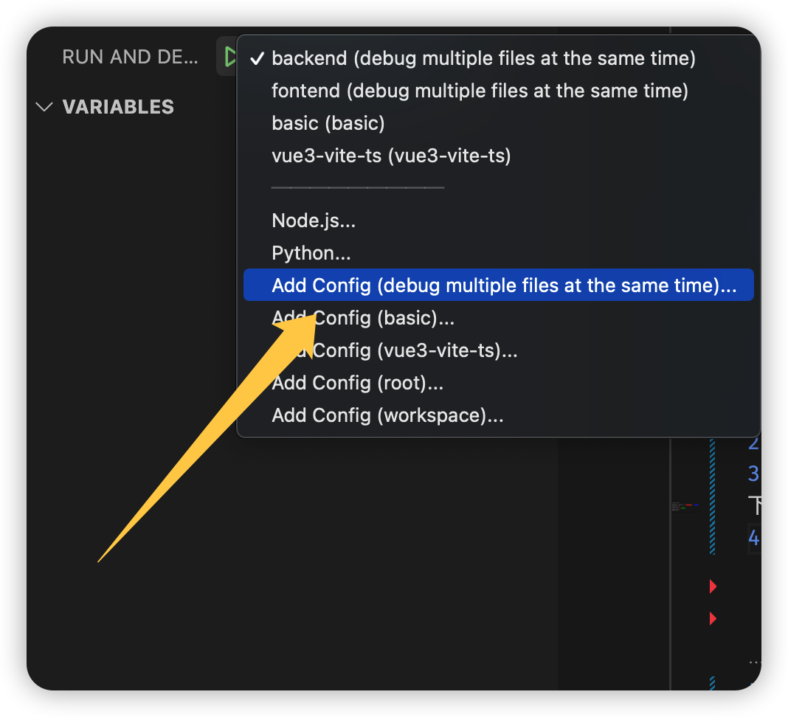
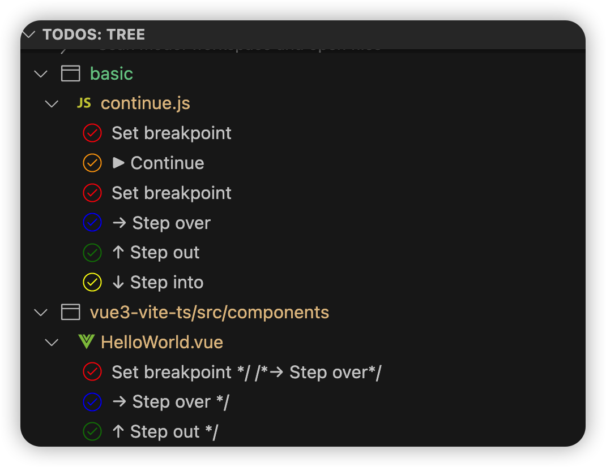

## 使用方法

### 初始化

点击根目录下的 debug-example.core-workspace，vscode 会打开一个 workspace

> 以下操作均在打开 workspace 后执行

### 添加新示例

1. 在项目根目录下新建文件夹用于存储新示例
2. 添加新文件夹到 workspace
3. 添加断点及断点注释。使用 [snippet](basic/.vscode/basic.code-snippets) 标记断点及断点处 debug 操作，如下所示
4. 新建 launch config。

### Debug 已有的示例

1. 查看示例文件夹中的 README
1. 使用 TODO Tree 快速定位到断点或断点操作 
1. 添加断点
1. 屏蔽其他示例中的断点 (不屏蔽偶尔会出现无法执行 debug 的情况)
1. 选择示例对应的 launch config 开始 debug

## 注意事项

-   workspace 中的 root 文件夹不是示例
