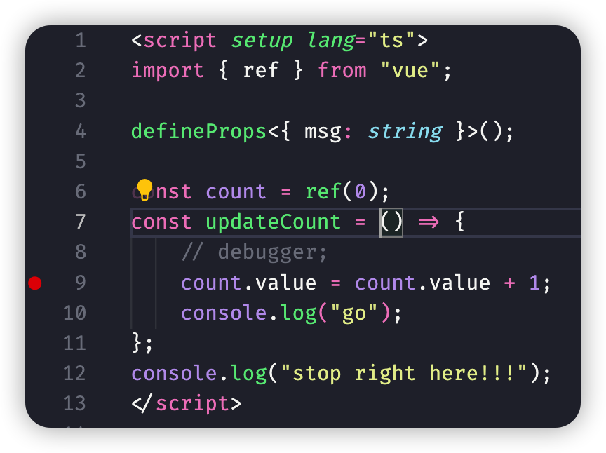
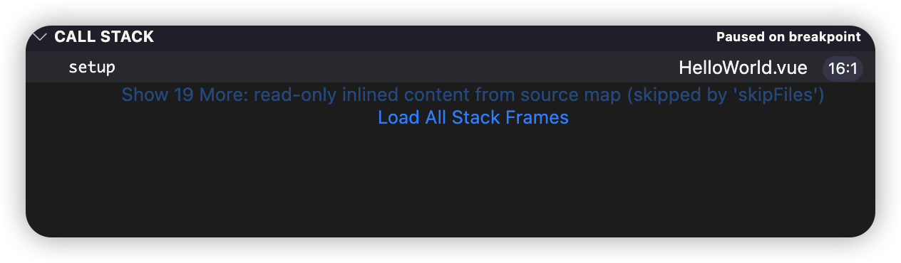
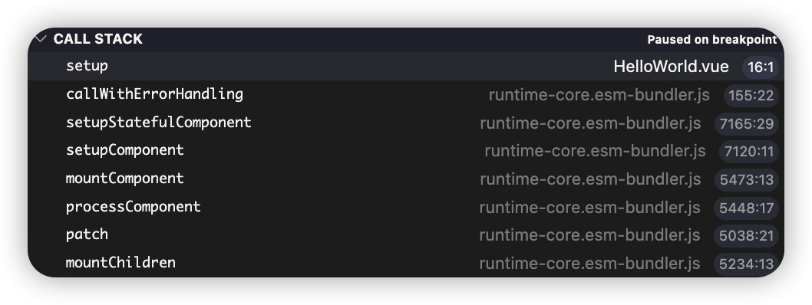
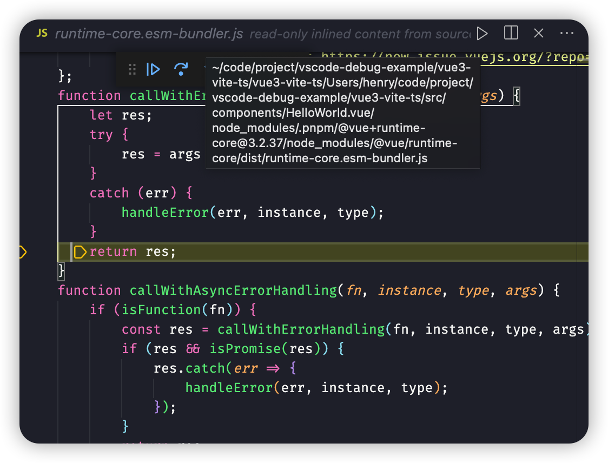
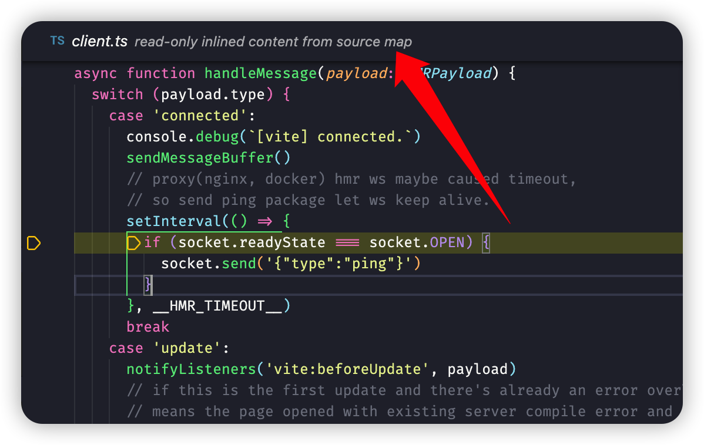

## 注意

| Do                                                                                                                                       | Don't                                       |
| ---------------------------------------------------------------------------------------------------------------------------------------- | ------------------------------------------- |
| 调试 setup 中定义的函数时，断点应该放在函数体中   | 在 setup 中添加断点，然后在调试中 step into |
| 调试过程中总是总是会跳入 client.ts，使用 skipFiles 屏蔽                                                                                  |                                             |

<!--TODO -   深入了解 skipFiles 和 smartStep 的用法 -->

## 测试

以下列拒了各类测情况，及各类情况下的 callStack

1.  不开启 vite sourceMap，不使用 skipFils (默认)
2.  不开启 vite sourceMap，使用 skipFils 
3.  开启 vite sourceMap，不使用 skipFils 
4.  开启 vite sourceMap，使用 skipFils

### setup scope

| action/config | 1                       | 2                                                      | 3         | 4   |
| ------------- | ----------------------- | ------------------------------------------------------ | --------- | --- |
| continue      |                         |                                                        |           |
| step over     | sourceMap               | 无特殊情况，一段时间过后会跳入 [client.ts](#client-js) | sourceMap |
| step into     | [client.ts](#client-js) | 无特殊情况，一段时间过后会跳入 [client.ts](#client-js) | sourceMap |
| step out      | sourceMap               | 无特殊情况，一段时间过后会跳入 [client.ts](#client-js) | sourceMap |

### setup func scope

| action/config | 1         | 2                                                          | 3          | 4   |
| ------------- | --------- | ---------------------------------------------------------- | ---------- | --- |
| continue      |           |                                                            | 无特殊情况 |     |
| step over     | sourceMap | 无特殊情况，一段时间过后会跳入 [client.ts](#client-js)     | sourceMap  |     |
| step into     | sourceMap | 不会跳入 sourceMap，一段时间后跳入 [client.ts](#client-js) | sourceMap  |     |
| step out      |           | 无特殊情况，一段时间过后会跳入 [client.ts](#client-js)     | sourceMap  |     |

## 索引

### runtime-core

-   路径: ~/code/project/vscode-debug-example/vue3-vite-ts/vue3-vite-ts/Users/henry/code/project/vscode-debug-example/vue3-vite-ts/src/components/HelloWorld.vue/node_modules/.pnpm/@vue+runtime-core@3.2.37/node_modules/@vue/runtime-core/dist/runtime-core.esm-bundler.js
-   注意编辑器上方文字提示有 sourcemap 

### client-js

